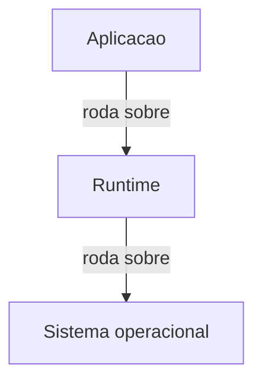

# Objetivo da skill

Quando o usuário pedir ajuda para preparar ou conduzir uma aula sobre um tema específico (ex.: ponteiros em C, structs, HTTP, SOLID, testes), siga este roteiro genérico.

A aula deve:
- Introduzir o tema em um contexto claro.
- **Ficar dentro do escopo de tópicos definido na requisição.**
- Verificar a atualidade dos dados antes de escrever qualquer conteúdo.
- Explicar o conceito de forma estruturada e simples.
- Verificar se os alunos entenderam a ideia central.
- Propor exercícios guiados com foco em acurácia.
- Encerrar com uma atividade aplicada e realista.
- Gerar arquivos `.md` organizados para uso em aula e estudo posterior, mais uma apresentação `reveal.js` para projetar em sala.
- Gerar um pequeno relatório de feedback ao final, para ajustar a skill.

---

## Entradas esperadas

Antes de executar o fluxo, colete:

- **ASSUNTO**: tema da aula (ex.: "ponteiros em C").  
- **ESCOPO**: a lista de tópicos que a aula cobre — e, quando houver, o que ela explicitamente **não** cobre. Costuma vir da ementa, do cronograma da disciplina ou do enunciado do pedido. **Se o pedido enumera tópicos, essa enumeração é o escopo.**  
- **PÚBLICO-ALVO**: nível dos alunos (ex.: "iniciantes em C", "estudantes de graduação").  
- **DURAÇÃO ESTIMADA**: tempo de aula (ex.: "50 minutos").  
- **FORMATO**: presencial, remoto, hands-on, etc.  
- Opcional: restrições (ex.: "sem usar alocação dinâmica", "foque em exemplos de backend").

---

## Regra de escopo: o programa da aula é um contrato

Esta regra vem **antes** de todos os passos, porque governa o que entra em cada um deles.

Uma aula quase nunca é um evento isolado: ela faz parte de um programa, e alguém já decidiu o que cabe em cada encontro. Quando você acrescenta um tópico "adjacente", "mais moderno" ou "que a turma vai perguntar", você não está enriquecendo a aula — está gastando minutos que pertenciam a outro conteúdo, criando expectativa de avaliação sobre algo que não foi combinado, e às vezes **queimando a aula seguinte**, que existia justamente para aquilo.

### 1. Extraia o escopo literalmente, antes de planejar

- Se o pedido, a ementa ou o cronograma **enumeram** tópicos (componentes, funções, comandos, capítulos), trate a enumeração como **lista fechada**. Escreva-a por extenso antes de começar.
- Prefira as palavras da fonte às suas. Se o cronograma diz "View, ScrollView, Text, TextInput, Image, Button e StyleSheet", o escopo tem **sete** itens — não "os componentes básicos de UI", que é uma paráfrase elástica e sempre cresce.
- **Pré-requisito não é escopo.** Um assunto de aula anterior pode ser usado sem ser reensinado — e não vira conteúdo novo.
- **Citar não é ensinar.** Uma menção de uma linha para situar o aluno é aceitável; um slide, um exemplo de código, um exercício ou um gabarito **é ensinar** e precisa estar no escopo.

### 2. Os três vetores de fuga de escopo

Conheça-os pelo nome — é assim que você os pega em si mesmo.

**a) "Mas a prática recomendada hoje é outra."**
Este é o mais perigoso, porque se disfarça de Passo 2 (atualidade). Distinga com precisão:

- ✅ **Corrigir um fato desatualizado sobre um tópico que está no escopo** — obrigatório. *"Sobre o componente X, que está no programa, a forma atual de fazer Y é Z."*
- ❌ **Substituir um tópico do escopo por outro que não está** — fuga de escopo. *"X é limitado, use W"*, onde W não está no programa.

Quando a resposta moderna mora fora do escopo: **declare a limitação com honestidade e pare ali.** Não ensine a alternativa. Registre no plano de aula que o assunto foi deliberadamente adiado.

**b) "É a pergunta que a turma vai fazer."**
Provavelmente vai mesmo — e a resposta certa é uma frase, não um slide. Prepare no `lesson-plan.md` uma **frase de estacionamento** para o professor (*"ótima pergunta, e não é o assunto de hoje"*) e siga o roteiro.

**c) "Já que estamos aqui, é barato acrescentar."**
Nunca é barato. Todo tópico novo custa minutos de exposição, espaço nos slides, um exercício para fixar, um gabarito para conferir e carga cognitiva do aluno. Se não estava no programa, não é de graça: é uma troca silenciosa.

### 3. Quando o escopo parece ter um buraco de verdade

Às vezes o recorte pedido deixa um problema real — um exercício que não fecha, uma limitação sem saída dentro do catálogo permitido.

**Não conserte em silêncio ampliando o escopo.** Faça as duas coisas:
1. Entregue a aula **dentro do escopo**, resolvendo o exercício com o que é permitido.
2. **Diga ao usuário**, na resposta e nas notas do professor, qual é a limitação e que decisão você tomou. Ampliar o programa é escolha de quem ensina, não sua.

### 4. Declare o escopo dentro dos artefatos

Todo material gerado carrega um bloco de escopo explícito — ele protege o professor em sala e o aluno na hora de estudar:

```markdown
> ⚠️ **Escopo desta aula:** [lista literal do que entra].
>
> **Fica de fora, e não deve ser introduzido:** [lista do que foi deliberadamente excluído,
> com uma frase de por quê]. Se a turma puxar para esses assuntos, estacionar com
> "ótima pergunta — não é o assunto de hoje" e voltar ao roteiro.
```

Nos artefatos do **aluno** (`student-notes.md`, `exercises.md`, slides), a versão é curta e sem lista de proibidos detalhada — basta dizer o que a aula cobre e que o resto vem depois. A lista completa do que ficou de fora é informação **do professor**, e mora no `lesson-plan.md`.

### 5. Verifique antes de entregar

Fuga de escopo se esconde onde ninguém relê: exemplos de código, enunciados de exercício e **gabaritos**.

Antes de declarar a aula pronta, faça uma varredura mecânica:

1. Liste os identificadores fora de escopo (nomes de componentes, funções, comandos, bibliotecas).
2. Busque cada um em **todos** os artefatos gerados.
3. **Artefatos do aluno devem dar zero.** As únicas ocorrências aceitáveis são os avisos de exclusão de escopo, e eles vivem no material do professor.

```bash
grep -rn -e 'TopicoForaDeEscopo1' -e 'TopicoForaDeEscopo2' aulas/<slug>/
```

Se algo aparecer, não basta apagar a palavra: reescreva o trecho com o que está no escopo, e confira se o exercício ou o exemplo ainda faz sentido depois da troca.

---

## Passo 1 – Introdução com contexto

Sempre começar a aula assim:

1. **Apresentar o tema e seu contexto**
   - Diga em 1–2 frases:
     - o nome do assunto,
     - em que contexto ele aparece,
     - que problema ajuda a resolver.
   - Ex.: "Hoje vamos estudar [ASSUNTO], que é usado em [CENÁRIO] para [OBJETIVO]."

2. **Declarar o objetivo da aula**
   - Especifique o que o aluno deverá ser capaz de fazer ao final:
     - "Ao final da aula, você deve ser capaz de [AÇÃO 1], [AÇÃO 2] e [AÇÃO 3] com [ASSUNTO]."

3. **Criar uma agenda simples de tópicos**
   - Liste 3–5 tópicos principais em ordem lógica (do mais básico ao mais avançado).
   - Use isso como roteiro da explicação.
   - **A agenda sai do ESCOPO, não da sua ideia do que seria bom cobrir.** Se algum item da agenda não estiver na lista de tópicos definida na requisição, ele não entra. Se sobrar tempo, aprofunde o que já está lá — mais exemplos, mais prática, mais verificação — em vez de acrescentar assunto.

---

## Passo 2 – Verificação de atualidade dos dados

Antes de escrever **qualquer** conteúdo (slides, notas, exercícios), pare e verifique a atualidade do que você vai afirmar. Material didático desatualizado é pior que material ausente: o aluno decora um fato errado e leva anos para desaprender.

1. **Classifique o assunto: volátil ou estável**
   - **Volátil** – muda em meses: versões de software, dados de mercado (participação, adoção, preço), recomendações de ferramenta, APIs e SDKs, nomes de produto, limites de plano, requisitos de sistema.
   - **Estável** – muda em décadas ou nunca: matemática, algoritmos clássicos, teoria da computação, princípios de projeto, física.
   - Um mesmo assunto costuma ter as duas partes. "Ordenação" é estável; "qual biblioteca de ordenação usar em 2026" é volátil. Trate cada afirmação, não só o tema.

2. **Se for volátil, pesquise fontes primárias antes de escrever**
   - Ordem de preferência:
     1. documentação oficial do projeto/fornecedor,
     2. release notes e changelog,
     3. registries (npm, PyPI, Maven Central, crates.io) para versões publicadas,
     4. blog oficial dos mantenedores,
     5. só então artigos secundários (blogs de terceiros, tutoriais, agregadores).
   - **Prefira sempre a fonte primária ao artigo secundário.** Um tutorial bem escrito de 2023 pode estar descrevendo uma arquitetura que já foi removida.
   - Não escreva número, versão ou "o mais usado hoje é X" sem ter aberto a fonte.

3. **Registre a procedência de cada afirmação**
   - Para toda afirmação numérica ou de versão, anote:
     - a **URL** da fonte,
     - a **data de verificação**.
   - Essas informações vão para a seção "Fontes dos dados citados" do `lesson-plan.md` e do `student-notes.md`, e para o campo de data de verificação no cabeçalho.

4. **Procure ativamente pelo que o material didático comum ainda ensina errado**
   - Faça uma varredura deliberada por fatos "zumbis": coisas que continuam sendo repetidas em cursos, apostilas e vídeos, mas já não valem.
   - Padrões típicos:
     - comandos e flags descontinuados que ainda aparecem em tutoriais,
     - arquiteturas ou componentes removidos do produto,
     - diagramas copiados de documentos oficiais já arquivados,
     - produtos, planos ou serviços descontinuados/renomeados,
     - números de mercado repetidos há anos sem nova medição.
   - **Corrija isso explicitamente no material**, com um "o que você vai encontrar por aí" versus "o que vale hoje". O aluno vai esbarrar no material velho na internet; é melhor ele já chegar lá vacinado.
   - ⚠️ **A correção obedece ao escopo.** Este é o ponto onde a fuga de escopo mais acontece, porque ela se disfarça de rigor técnico. A regra:
     - Se o fato desatualizado é **sobre um tópico do escopo**, corrija à vontade — é exatamente o trabalho deste passo.
     - Se a correção consistiria em **trocar um tópico do escopo por outro que não está**, você não pode fazer a troca. Diga a verdade sobre a limitação do que está no programa, **sem ensinar o substituto**, e registre no `lesson-plan.md` que o assunto ficou para depois.
     - Teste rápido: *a correção acrescenta um nome novo ao vocabulário da aula?* Se sim, é conteúdo novo — e conteúdo novo precisa estar no escopo.

5. **Divergência entre fontes confiáveis é conteúdo, não obstáculo**
   - Se duas fontes confiáveis discordarem (dois institutos com números diferentes de participação de mercado, duas medições de desempenho, duas recomendações opostas), **apresente as duas e explique a divergência metodológica**: o que cada uma mediu, com que amostra, em que período.
   - Não escolha uma em silêncio. Mostrar por que os números diferem ensina leitura crítica de dados, que é uma competência mais durável que o número em si.

6. **Versão mais nova nem sempre é a versão recomendada**
   - Quando existir uma versão nova mas o ecossistema em volta (bibliotecas, frameworks, plugins, ferramentas de build, imagens Docker, provedores de hospedagem) ainda não a suportar, **recomende a versão que funciona** e explique o motivo ao aluno.
   - Deixe claro no material: "a versão X já saiu, mas usamos a Y porque [dependência] ainda não suporta X — reconferir em [prazo]".

7. **Pesquisa grande pode ser delegada**
   - Se a verificação exigir consultar muitas fontes (comparar várias ferramentas, levantar histórico de versões, cruzar dados de mercado), considere delegar a um subagente de pesquisa e trabalhar com o resultado consolidado, em vez de fazer a varredura inteira no fluxo principal da aula.

---

## Passo 3 – Explicação estruturada do conceito

Explique qualquer assunto seguindo esta estrutura:

1. **Definição em uma frase**
   - Formato:
     - "[ASSUNTO] é [O QUE É] usado para [FINALIDADE]."
   - Evite jargão excessivo na primeira frase.

2. **Analogia ou exemplo intuitivo**
   - Crie uma analogia com:
     - algo do cotidiano, ou
     - algo familiar para devs (arquivos, funções, caixas, estradas, etc.).
   - Objetivo: tornar o conceito “visual” e mais fácil de imaginar.

3. **Quebrar em 2–4 componentes**
   - Explique:
     - do que o assunto é composto (partes principais),
     - como funciona (fluxo ou comportamento),
     - quando é usado (situações típicas).
   - Use listas curtas para manter clareza.

4. **Mini-exemplo concreto**
   - Mostre um exemplo pequeno e comentado, adequado ao assunto:
     - código,
     - diagrama simples (sempre em Mermaid — ver "Regra de diagramas" mais abaixo),
     - caso prático.
   - O exemplo deve ser fácil de percorrer passo a passo em voz alta.

---

## Passo 4 – Verificação conceitual (antes de avançar)

Sempre verificar se os alunos entenderam o núcleo do assunto:

1. **Perguntas conceituais**
   - Gere 2–3 perguntas como:
     - "Explique com suas palavras o que é [ASSUNTO]."
     - "Em qual situação você usaria [ASSUNTO]?"
     - "Qual a diferença entre [ASSUNTO] e [CONCEITO RELACIONADO]?"

2. **Reformulação**
   - Se houver confusão, reformule a explicação:
     - com nova analogia,
     - com outro exemplo simples,
     - reduzindo termos técnicos.

3. **Só avançar depois da clareza mínima**
   - Não seguir para exercícios enquanto o grupo não tiver entendido a ideia central do assunto.

---

## Passo 5 – Exercícios guiados com foco em acurácia

Agora os alunos praticam o assunto de forma assistida:

1. **Criar exercícios de preenchimento, associação ou reprodução**
   - Exemplos de tipos de tarefa:
     - completar código ou raciocínio,
     - associar conceitos (colunas, pares),
     - reproduzir um exemplo que foi mostrado na explicação.
   - O foco aqui é usar o assunto de forma correta, não criativa.

2. **Orientação durante os exercícios**
   - Enquanto os alunos resolvem:
     - acompanhar de perto,
     - apontar erros comuns,
     - corrigir imediatamente pequenos desvios,
     - reforçar o “jeito certo” de aplicar o conceito.

3. **Manter o nível de dificuldade baixo**
   - Nesta etapa, os exercícios devem ser simples o suficiente para o aluno se concentrar em acurácia, não em complexidade.

4. **Enunciados e gabaritos ficam no escopo**
   - Cada exercício só pode exigir o que a aula ensinou. Um enunciado que só se resolve bem com um recurso fora do escopo é um enunciado quebrado — reescreva o enunciado, não amplie a aula.
   - **Reveja os gabaritos com atenção redobrada.** É onde a fuga de escopo passa despercebida: o enunciado está correto, e a resposta "ideal" usa uma ferramenta que a turma não viu.
   - Se um exercício herdado de material antigo depender de algo fora do escopo, ele tem duas saídas: reescrever com o que é permitido, ou virar o próprio conteúdo — *"por que isto não se resolve com o que temos?"* costuma ser uma ótima pergunta, desde que a resposta não seja uma aula sobre o que está fora.

---

## Passo 6 – Atividade aplicada e realista

Encerrar a aula com uma tarefa que aproxime o assunto da prática:

1. **Propor uma atividade mais aberta**
   - Pedir que o aluno use o assunto em:
     - um mini-projeto,
     - um caso realista,
     - um problema prático.
   - A atividade deve exigir decisão, não só repetição mecânica.

2. **Conectar explicitamente com o contexto inicial**
   - Relembrar:
     - o problema ou cenário mostrado no Passo 1,
     - como o assunto ajuda a lidar com esse problema.
   - Mostrar ao aluno “onde isso se encaixa no mundo de verdade”.

3. **Definir critérios de uma boa solução**
   - Explicar o que você considera:
     - correto,
     - bem aplicado,
     - claro.
   - Usar esses critérios para feedback.

---

## Regra de diagramas: sempre Mermaid, nunca ASCII

Vale para **todos** os artefatos desta skill (plano de aula, notas, slides `.md`, slides `.html`, exercícios) e para o que você escrever no chat durante a aula.

**Todo diagrama, fluxo, arquitetura em camadas, linha do tempo, árvore de decisão ou máquina de estados deve usar notação Mermaid, dentro de bloco de código com a linguagem `mermaid`.**

Nunca use arte ASCII/ANSI: nada de caixas com `┌─┐`/`└─┘`, setas `-->` soltas em texto puro, indentação simulando hierarquia. Isso quebra em qualquer largura de tela diferente da sua, some no projetor, é ilegível em leitor de tela e não dá para editar.



### Que tipo de diagrama usar

| Tipo | Use para |
| --- | --- |
| `flowchart` | arquiteturas, camadas, fluxos de decisão, pipelines, comparações lado a lado com `subgraph` |
| `stateDiagram-v2` | máquinas de estado, ciclos de vida de objeto/processo/requisição |
| `sequenceDiagram` | protocolos, handshakes, interações entre partes ao longo do tempo |
| `pie` | composição, participação, distribuição percentual |
| `timeline` | evolução histórica, marcos de versões |
| `mindmap` | mapa de tópicos, visão geral da aula |
| `erDiagram` | modelagem de dados, relacionamentos entre entidades |
| `gantt` | cronograma da disciplina, planejamento de projeto |

### Restrição de compatibilidade

Fique nos tipos amplamente suportados, listados acima. **Evite `block-beta` e qualquer diagrama marcado como beta/experimental** na documentação do Mermaid: o Obsidian, o Marp e o Mermaid vendorizado na apresentação podem estar em versões diferentes, e um diagrama beta que renderiza em um lugar aparece como bloco de erro vermelho no outro — inclusive no projetor, no meio da aula.

### Boas práticas

- **Camadas empilhadas**: use `flowchart TB` com os nós na ordem de empilhamento e rótulo na seta (ex.: `roda sobre`, `depende de`, `chama`), ou um `subgraph` por camada. Não tente desenhar retângulos empilhados manualmente.
- **Legibilidade no projetor**: poucos nós por diagrama (ideal ≤ 9), rótulos curtos (2–4 palavras). Prefira três diagramas pequenos a um diagrama grande — o grande fica com fonte minúscula quando o renderizador encolhe para caber no slide.
- **Rótulos**: não deixe acento nem parênteses soltos dentro do rótulo sem aspas. Escreva `A["Rótulo (com parênteses)"]`, não `A[Rótulo (com parênteses)]`.
- **Frase de leitura obrigatória**: todo diagrama vem acompanhado de uma frase no texto corrido que descreve o que ele mostra (ex.: "O diagrama mostra a requisição saindo do navegador, passando pelo proxy e chegando ao serviço de autenticação antes do banco."). Isso serve quem usa leitor de tela, quem imprimiu o material e quem está no fundo da sala.

---

## Passo 7 – Geração de arquivos de suporte

Ao concluir o planejamento da aula, materialize o resultado em **cinco arquivos**: quatro Markdown mais uma apresentação HTML.

1. **Roteiro da aula**  
   - Nome: `lesson-plan.md`  
   - Conteúdo:
     - título da aula,  
     - público-alvo, duração, formato,  
     - **bloco de escopo completo**: o que a aula cobre e o que fica **deliberadamente de fora**, com a frase de estacionamento para o professor (ver "Regra de escopo"),  
     - objetivos de aprendizagem,  
     - agenda de tópicos com tempo estimado,  
     - resumo de cada passo (1 a 6) com bullet points,  
     - data de verificação dos dados e seção "Fontes dos dados citados" (Passo 2).  
   - Uso: professor se guia por esse arquivo durante a aula. **É aqui — e só aqui — que mora a lista detalhada do que ficou fora do escopo e por quê.**

2. **Anotações para estudo dos alunos**  
   - Nome: `student-notes.md`  
   - Conteúdo:
     - explicação do assunto em linguagem acessível,  
     - **nota curta de escopo**: o que a aula cobre, e que o restante vem depois — sem a lista detalhada de exclusões, que é assunto do professor,  
     - definição, analogias, exemplos,  
     - pequenos resumos de cada conceito,  
     - pelo menos um diagrama Mermaid com sua frase de leitura,  
     - seção de “erros comuns” (em tabela) e “perguntas para autoavaliação”,  
     - data de verificação dos dados e seção "Fontes dos dados citados".  
   - Uso: alunos leem depois para revisar o conteúdo sem depender da fala do professor.

3. **Apresentação em Markdown (fonte)**  
   - Nome: `presentation.md`  
   - Conteúdo:
     - estrutura em forma de “slides em markdown”:  
       - seções com títulos e bullets,  
       - trechos de código e diagramas em blocos `mermaid`,  
       - notas do apresentador em comentário HTML,  
       - pontos de destaque para explicação em voz alta.  
   - Uso: fonte em Markdown da apresentação, compatível com Marp, e leitura rápida dentro do editor (Obsidian, VS Code) sem abrir navegador. Continua existindo mesmo com o `presentation.html`.

4. **Exercícios e sugestões de prática**  
   - Nome: `exercises.md`  
   - Conteúdo:
     - **nota de escopo no topo**: o que pode ser usado nas entregas (a lista literal), já que é ela que define o que será corrigido,  
     - lista de exercícios guiados (Passo 5),  
     - lista de atividades aplicadas (Passo 6),  
     - nível de dificuldade (⭐ a ⭐⭐⭐) e tempo estimado por exercício,  
     - gabaritos em blocos `<details><summary>`, para o aluno só abrir depois de tentar,  
     - critérios de avaliação.  
   - Uso: material de prática em sala e tarefas para casa.

5. **Apresentação para projetar em sala**  
   - Nome: `presentation.html`  
   - Tecnologia: HTML + CSS + JavaScript com **reveal.js**.  
   - Uso: é a apresentação que vai ao projetor. Navegação por teclado, modo apresentador com notas em tela separada, visão geral dos slides.  
   - Base: `assets/presentation.reveal.template.html`.

### Regras do `presentation.html` (reveal.js)

**Dependências vendorizadas localmente, nunca CDN.** O Wi-Fi da sala de aula não é confiável, e uma apresentação que depende de rede é uma apresentação que um dia não abre. Crie `vendor/reveal/` e `vendor/mermaid/` dentro da pasta da aula:

```bash
cd aulas/<slug>
mkdir -p vendor/reveal vendor/mermaid

npm pack reveal.js
tar -xzf reveal.js-*.tgz
npm pack mermaid
tar -xzf mermaid-*.tgz
```

Do pacote `reveal.js` (`package/`), copie para `vendor/reveal/` mantendo a estrutura:

- `dist/reveal.js`
- `dist/reveal.css`
- `dist/reset.css`
- `dist/theme/<tema>.css` (ex.: `white.css`, `black.css`)
- `dist/plugin/highlight.js` e `dist/plugin/highlight/monokai.css`
- `dist/plugin/notes.js`
- `dist/plugin/search.js`
- `dist/plugin/zoom.js`

Do pacote `mermaid`, copie `dist/mermaid.min.js` para `vendor/mermaid/`.

**Use sempre as versões UMD (`.js`), nunca as ESM (`.mjs`).** A apresentação é aberta direto do disco, via `file://`, e módulos ES sofrem restrição de CORS nesse protocolo: o navegador recusa o carregamento e a tela fica em branco. Com UMD e `<script src="...">` comum, abre com duplo clique.

**Diagramas nos slides:**

- Vão em `<pre class="mermaid">` (não em bloco de código Markdown).
- Inicialize com `mermaid.initialize({ startOnLoad: false })`.
- Dispare a renderização (`await mermaid.run()`) **antes** de `Reveal.initialize()`. Se o Mermaid rodar depois, o reveal.js já terá calculado o layout com os blocos ainda vazios e os diagramas saem com tamanho errado — minúsculos, cortados ou estourando o slide.
- **Cuidado com o `display:none` do reveal.css.** Antes da inicialização, o reveal.css deixa todo `<section>` com `display:none`. Se o Mermaid rodar assim, ele mede os rótulos como zero e desenha o gráfico de erro (“Syntax error in text”) no lugar do diagrama. O template resolve tornando os slides visíveis só durante a renderização e devolvendo o controle ao reveal logo em seguida — não remova esse trecho.
- O Mermaid grava um `max-width` fixo em px no `style` inline do SVG. Sem uma regra `max-width: 100% !important` no CSS, o diagrama não acompanha a largura do slide.

**Notas do apresentador:** dentro de `<aside class="notes">` no slide correspondente. Aparecem na tela do apresentador (`S`), não no projetor.

**Atalhos a documentar** (em um slide de ajuda ao final ou em comentário no rodapé do arquivo):

| Tecla | Ação |
| --- | --- |
| `S` | modo apresentador (notas, próximo slide, cronômetro) |
| `F` | tela cheia |
| `O` ou `Esc` | visão geral dos slides |
| `B` | tela preta (pausa a atenção na sua fala) |
| setas / espaço | navegar |

### Arquivos auxiliares desta skill

Esta skill pressupõe a existência de arquivos auxiliares na pasta:

- `assets/lesson-plan.template.md`  
- `assets/student-notes.template.md`  
- `assets/presentation.template.md`  
- `assets/exercises.template.md`  
- `assets/presentation.reveal.template.html`  

Scripts disponíveis:

- `scripts/new_lesson.sh <slug> [diretório-destino]` – cria `<destino>/aulas/<slug>/` com os 4 arquivos `.md` e o `presentation.html`, a partir dos templates.  
- `scripts/new_lesson.py <slug> [diretório-destino]` – versão em Python com a mesma função.

Em ambos, o **diretório de destino é opcional e o default é o diretório de trabalho atual**, não a pasta da skill. Assim a aula nasce dentro do vault/repositório em que você está trabalhando. Os templates continuam sendo lidos de dentro da pasta da skill. Arquivos de destino já existentes não são sobrescritos: o script avisa e pula.

Os scripts não baixam nada da rede — a vendorização do reveal.js e do Mermaid em `vendor/` é um passo manual, com os comandos `npm pack` descritos acima.

Fluxo recomendado:

1. **Escrever o escopo por extenso**, extraído literalmente do pedido/ementa/cronograma, antes de qualquer outra coisa (ver "Regra de escopo").  
2. Escolher um `slug` para o assunto (ex.: `ponteiros-em-c`).  
3. Executar um dos scripts de `scripts/` para criar a pasta `<destino>/aulas/<slug>/`.  
4. Verificar a atualidade dos dados (Passo 2) e anotar URLs e datas de verificação — **corrigindo apenas fatos sobre tópicos que estão no escopo**.  
5. Preencher os arquivos com o conteúdo gerado seguindo os Passos 1–6, usando Mermaid em todo diagrama.  
6. **Varredura de escopo**: buscar cada identificador fora de escopo em todos os artefatos. Artefatos do aluno devem dar zero (ver "Regra de escopo", item 5).  
7. Vendorizar o reveal.js e o Mermaid em `vendor/` e testar a apresentação abrindo o `presentation.html` no navegador, **antes** da aula.  
8. Após consolidar a aula, salvar uma versão final em `references/<slug>/` para servir de exemplo e ponto de partida das próximas aulas.  
9. Registrar ao final um breve relatório de feedback (o que funcionou, o que confundiu os alunos, o que ajustar na skill).

---

## Checklist de entrega

Antes de dizer que a aula está pronta:

- [ ] O escopo foi extraído **literalmente** da requisição e está escrito por extenso.
- [ ] A agenda e os objetivos só contêm itens do escopo.
- [ ] Nenhum tópico novo entrou como "correção de atualidade" (Passo 2, item 4).
- [ ] Exemplos de código, enunciados **e gabaritos** usam apenas o que está no escopo.
- [ ] `lesson-plan.md` traz o bloco de escopo completo, com o que ficou de fora e a frase de estacionamento.
- [ ] Artefatos do aluno trazem a nota curta de escopo.
- [ ] A varredura por identificadores fora de escopo deu **zero** nos artefatos do aluno.
- [ ] Toda afirmação volátil tem fonte e data de verificação.
- [ ] Todo diagrama é Mermaid e tem sua frase de leitura.
- [ ] O `presentation.html` foi aberto num navegador e os diagramas renderizaram.
- [ ] Se o escopo pedido criou uma limitação real, ela foi **comunicada ao usuário** em vez de contornada por conta própria.