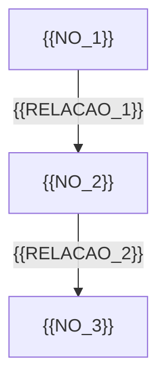

# Apresentação: {{ASSUNTO}}

---

## Slide 1 – Contexto

- O que é {{ASSUNTO}}?
- Onde aparece no dia a dia / no trabalho?
- Por que é importante aprender isso agora?

<!--
ESCOPO DESTA AULA (nota do apresentador, não vai para o slide):
  Entra: {{ESCOPO_INCLUI_RESUMO}}
  Fica de fora: {{ESCOPO_EXCLUI_RESUMO}}
  Se a turma puxar para fora: "ótima pergunta — não é o assunto de hoje."
-->

---

## Slide 2 – Definição simples

- {{DEFINICAO_SIMPLIFICADA}}
- Analogias:
  - {{ANALOGIA_1}}

---

## Slide 3 – Estrutura

- Componentes:
  - {{COMPONENTE_1}}
  - {{COMPONENTE_2}}
- Como funciona:
  - {{DESCRICAO_FUNCIONAMENTO}}

---

## Slide 4 – Visão geral em diagrama

<!-- Diagramas sempre em Mermaid, nunca em arte ASCII.
     Tipos seguros: flowchart, stateDiagram-v2, sequenceDiagram, pie, timeline,
     mindmap, erDiagram, gantt. Evite block-beta e outros diagramas beta.
     Máximo ~9 nós por diagrama, rótulos curtos, sempre entre aspas. -->



Como ler: {{LEITURA_DIAGRAMA}}

<!-- notas do apresentador
{{NOTA_APRESENTADOR_DIAGRAMA}}
Percorrer o diagrama em voz alta, de cima para baixo, antes de falar dos detalhes.
-->

---

## Slide 5 – Exemplo principal

```{{LINGUAGEM}}
{{EXEMPLO_MAIN}}
```

<!-- notas do apresentador
{{NOTA_APRESENTADOR_EXEMPLO}}
-->

---

## Slide 6 – Resumo e próximos passos

- O que você deve ser capaz de fazer com {{ASSUNTO}}:
  - {{OBJETIVO_1}}
  - {{OBJETIVO_2}}
- Onde isso será usado depois:
  - {{CENARIO_FUTURO}}

<!-- notas do apresentador
{{NOTA_APRESENTADOR_FECHAMENTO}}
Retomar o problema do Slide 1 e fechar o ciclo.
-->

---

<!--
Este arquivo é a fonte em Markdown da apresentação (compatível com Marp) e serve
para leitura rápida dentro do editor. A apresentação de projetar em sala é o
`presentation.html`, em reveal.js, com as mesmas seções.

Dados citados verificados em: {{DATA_VERIFICACAO}}
-->

# Fontes

- {{FONTE_URL_1}} – verificado em {{DATA_VERIFICACAO_1}}
- {{FONTE_URL_2}} – verificado em {{DATA_VERIFICACAO_2}}