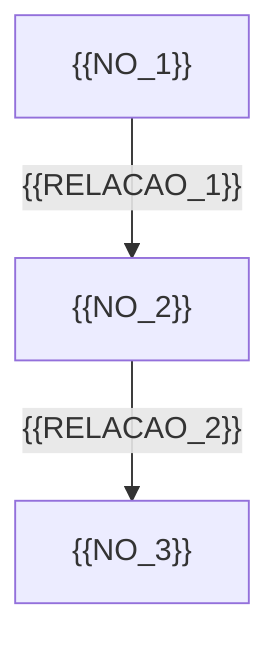

# Notas de Estudo: {{ASSUNTO}}

- Aula: {{DATA_AULA}}
- Dados verificados em: {{DATA_VERIFICACAO}}

## Visão geral

{{RESUMO_ASSUNTO}}

> 📌 **O que esta aula cobre:** {{ESCOPO_RESUMIDO}}.
> Assuntos vizinhos que você talvez espere encontrar aqui chegam mais adiante na disciplina —
> se bater numa parede usando só o que está neste material, provavelmente é isso, e não erro seu.

## Definição

{{DEFINICAO_SIMPLIFICADA}}

## Analogias e exemplos intuitivos

- {{ANALOGIA_1}}
- {{EXEMPLO_INTUITIVO_1}}

## Componentes principais

- {{COMPONENTE_1}}
- {{COMPONENTE_2}}
- {{COMPONENTE_3}}

## Visão geral em diagrama

<!-- Todo diagrama é Mermaid. Nunca arte ASCII. Máximo ~9 nós, rótulos curtos. -->



Como ler o diagrama: {{LEITURA_DIAGRAMA}}

## Mini-exemplos

```{{LINGUAGEM}}
{{EXEMPLO_MINI_1}}
```

## Erros comuns

| Erro | Por que acontece | O jeito certo |
| --- | --- | --- |
| {{ERRO_COMUM_1}} | {{CAUSA_ERRO_1}} | {{CORRECAO_ERRO_1}} |
| {{ERRO_COMUM_2}} | {{CAUSA_ERRO_2}} | {{CORRECAO_ERRO_2}} |
| {{ERRO_COMUM_3}} | {{CAUSA_ERRO_3}} | {{CORRECAO_ERRO_3}} |

## Cuidado com material desatualizado

| O que você vai achar na internet | O que vale hoje |
| --- | --- |
| {{DESATUALIZADO_1}} | {{ATUAL_1}} |
| {{DESATUALIZADO_2}} | {{ATUAL_2}} |

## Perguntas para autoavaliação

- {{PERGUNTA_1}}
- {{PERGUNTA_2}}
- {{PERGUNTA_3}}

## Fontes dos dados citados

| Afirmação | Fonte (URL) | Verificado em |
| --- | --- | --- |
| {{AFIRMACAO_1}} | {{FONTE_URL_1}} | {{DATA_VERIFICACAO_1}} |
| {{AFIRMACAO_2}} | {{FONTE_URL_2}} | {{DATA_VERIFICACAO_2}} |
| {{AFIRMACAO_3}} | {{FONTE_URL_3}} | {{DATA_VERIFICACAO_3}} |

> **Este material tem prazo de validade.** Versões, números de mercado e recomendações de
> ferramenta foram verificados em {{DATA_VERIFICACAO}} e podem ter mudado desde então.
> Antes de reutilizar estas notas em outro semestre, reconfira cada item da tabela acima
> nas fontes originais.